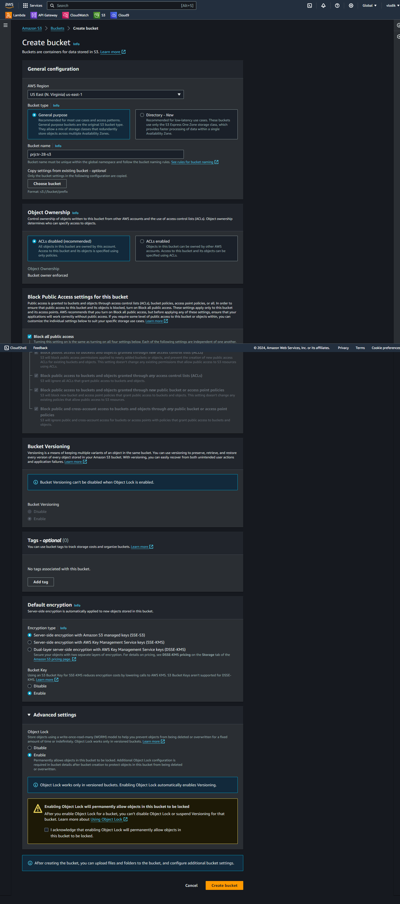
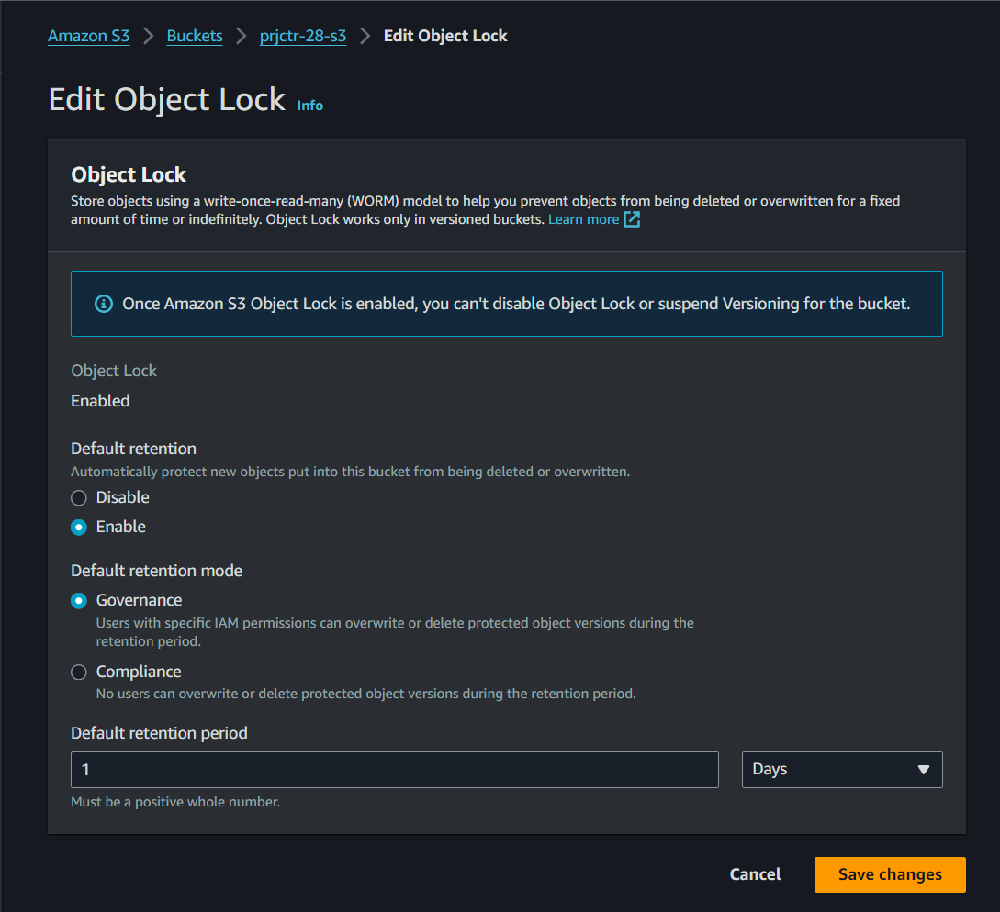
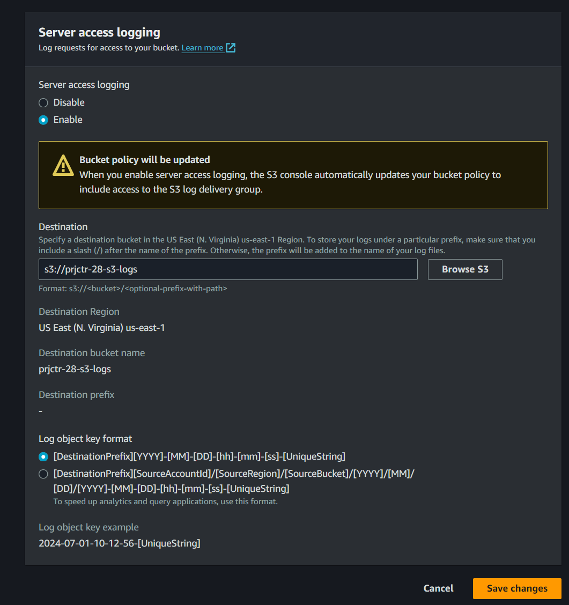

# S3 Bucket Configuration with Object Lock and Request Logging

## Overview
This project demonstrates how to create an Amazon S3 bucket configured to prevent object modification and log all access requests. The process involves setting up an S3 bucket, enabling object lock to make objects immutable, and configuring server access logging for auditability.

## Features
- **Immutable Object Storage:** Utilizes S3 Object Lock to prevent objects from being modified or deleted.
- **Access Logging:** Tracks all requests to the bucket for security and auditing purposes.

## Getting Started

These instructions will guide you through the process of setting up your S3 bucket with the desired configurations.

### Prerequisites
- AWS account
- AWS CLI installed and configured (optional, for command-line setup)
- Permissions to create and manage S3 buckets and policies in your AWS account

### Installation and Setup

#### 1. Create S3 Bucket
Navigate to the S3 management console and create a new bucket. Ensure that "Block all public access" is enabled for security.

#### 2. Edit Object Lock Configuration
Enable Object Lock on the new bucket. Note: This has to be enabled at bucket creation and cannot be modified later.

#### 3. Configure Server Access Logging
Set up server access logging to monitor all requests made to your S3 bucket. Specify another bucket to store the log files.

## Usage
After setting up the bucket, you can start uploading objects. They will be protected by the Object Lock configuration, and all access requests will be logged as specified.

## Best Practices
- Regularly monitor your access logs for unusual access patterns or unauthorized access attempts.
- Consider enabling versioning on your S3 bucket to further protect your data.
